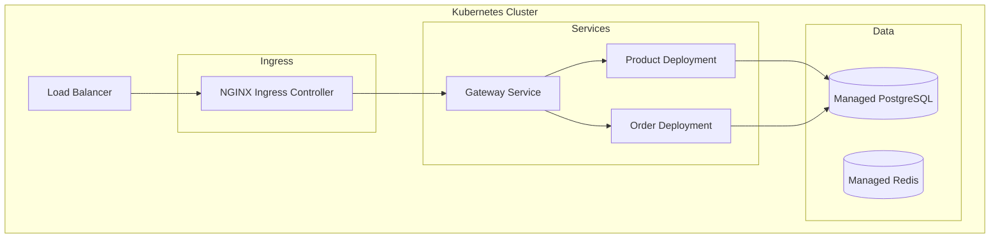

# High-Level Design

## Service Communication

### gRPC Communication Matrix

| Service | Calls | Protocol |
|---------|-------|----------|
| Gateway | All services | HTTP/2 (gRPC) |
| Order Service | Product, User, Payment, Inventory, Delivery | gRPC |
| Payment Service | User | gRPC |

## API Gateway Design

### Responsibilities
1. Authentication: Verify JWT tokens
2. Routing: Forward to appropriate service
3. Rate Limiting: 100 req/min per user
4. CORS: Configure allowed origins
5. Request ID: Add unique ID to all requests
6. Logging: Structured JSON logging
7. Error Handling: Normalize error responses

## Database Schema Design

### Schema Separation

```sql
-- Catalog schema
CREATE SCHEMA catalog;

-- Orders schema
CREATE SCHEMA orders;
```

## Deployment Architecture


