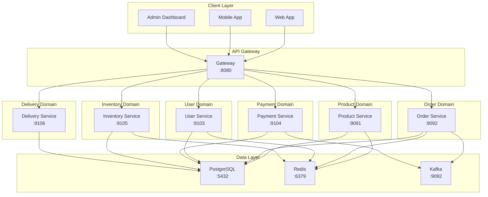
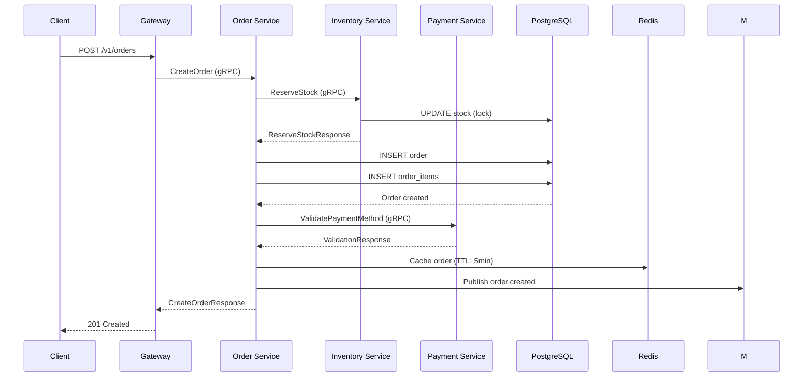
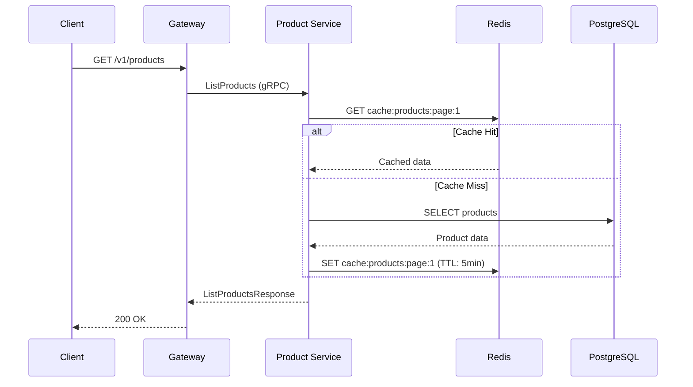

# Architecture Overview

## High-Level Architecture

The platform follows a microservices architecture with clear service boundaries based on domain-driven design principles.



## Service Boundaries

### Product Domain
**Responsibility**: Product catalog management

**Capabilities**:
- Product CRUD operations
- Category management
- Product variants (size, color)
- Product search
- Stock display (read-only)

**Data**: `catalog` schema

### Order Domain
**Responsibility**: Order lifecycle management

**Capabilities**:
- Order creation
- Order status transitions
- Order history
- Point redemption
- Delivery slot reservation

**Data**: `orders` schema

### User Domain
**Responsibility**: User identity and profile

**Capabilities**:
- User registration/login
- JWT token generation
- Profile management
- Address management

**Data**: `users` schema

### Payment Domain
**Responsibility**: Payment processing

**Capabilities**:
- Multiple payment methods
- Konbini payment slips
- Point integration
- Refunds

**Data**: `payments` schema

### Inventory Domain
**Responsibility**: Stock management

**Capabilities**:
- Stock level tracking
- Stock reservation (optimistic locking)
- Stock movement logging
- Inventory updates

**Data**: `inventory` schema
**Note**: Built in Rust for performance

### Delivery Domain
**Responsibility**: Delivery logistics

**Capabilities**:
- Delivery zones (PostGIS)
- Delivery slot management
- Shipment tracking
- Same-day delivery

**Data**: `delivery` schema

## Communication Patterns

### Synchronous: gRPC
Used for:
- Request/response operations
- Cross-service queries
- Real-time validation

**Example**:
```
Gateway → Order Service (create order)
Order Service → Inventory Service (reserve stock)
Inventory Service → PostgreSQL (update stock)
```

### Asynchronous: Kafka
Used for:
- Event publishing
- Decoupled processing
- Analytics integration

**Example**:
```
Order Service → Kafka (order.created event)
Analytics Worker ← Kafka (consume event)
Analytics Worker → PostgreSQL (update analytics)
```

## Data Flow Examples

### Order Creation Flow



### Product Browsing (Cached)



## Caching Strategy

| Data | Cache Location | TTL | Invalidation |
|------|---------------|-----|--------------|
| Product listings | Redis | 5 min | Product update/delete |
| Product details | Redis | 30 min | Product update |
| User sessions | Redis | 24 hr | Logout/timeout |
| Order details | Redis | 5 min | Order status update |

## Scalability Considerations

### Horizontal Scaling
- Stateless services (Gateway, Product, Order)
- Session store in Redis
- Load balancer: Kubernetes Service

### Database Scaling
- Read replicas for high-traffic services
- Connection pooling
- Query optimization

### Cache Scaling
- Redis Cluster for production
- Partitioning by domain
- Eviction policies

## Security

### Authentication
- JWT tokens (1 hr access, 24 hr refresh)
- HTTP Bearer token header
- Token verification in Gateway middleware

### Authorization
- Role-based access control (RBAC)
- Service-to-service: mutual TLS (future)
- Admin endpoints: additional role checks

### Network Security
- Internal gRPC: TLS (production)
- Gateway: HTTPS with Let's Encrypt
- API Gateway: Only public endpoint
