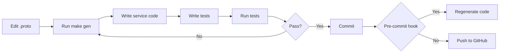
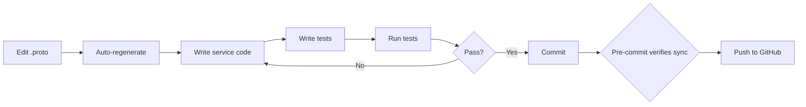

# Code Generation

## Overview

The Shinkansen Commerce project uses a **spec-first** approach where Protocol Buffers (`.proto` files) are the single source of truth. All code and documentation are generated from these files.

## Available Code Generation Targets

### 1. Generate All Code

```bash
make gen
```

This runs all generation targets:
- Go gRPC code (via `make proto-gen`)
- Rust protobuf code (via `make proto-gen-rust`)
- OpenAPI/Swagger specs (via `make proto-openapi-gen`)
- SQL code (via `make sqlc-gen`)
- API documentation (via `make docs-gen-api`)

### 2. Generate Go gRPC Code

```bash
make proto-gen
```

Generates Go code from `.proto` files into `gen/proto/go/`.

### 3. Generate Rust gRPC Code

```bash
make proto-gen-rust
```

Generates Rust code from `.proto` files into `gen/proto/rust/src/`.

### 4. Generate OpenAPI Docs

```bash
make proto-openapi-gen
```

Generates OpenAPI/Swagger YAML from `.proto` files into `services/gateway/docs/api/swagger.yaml`.

### 5. Generate API Documentation

```bash
make docs-gen-api
```

Generates VitePress markdown API documentation from `.proto` files into `docs/api/`.

### 6. Generate SQL Code

```bash
make sqlc-gen
```

Generates Go database access code from SQL migrations into `services/*/internal/db/`.

## Automated Workflow

### Recommended Manual Workflow

```bash
# 1. Edit .proto files
# 2. Regenerate code
make gen

# 3. Update service code
# 4. Write tests
# 5. Commit
git add .
git commit

# Pre-commit hook ensures generated code is synced
```

### Pre-commit Hook

A Git pre-commit hook is available to automatically regenerate code when committing `.proto` files.

**Installation:**
```bash
make install-git-hooks
```

**What it does:**
- Detects if any `.proto` files are staged for commit
- Runs `make gen` to regenerate all code
- Stages generated files for commit

**Benefits:**
- Never forget to regenerate code after proto changes
- Ensures generated code is always in sync with proto definitions

### Proto Watch Mode (Experimental)

A watch mode is available to automatically regenerate code when proto files are saved:

```bash
make proto-watch
```

**⚠️ Nix/NixOS Users:**

Watch mode requires `inotify-tools` to be available in your Nix profile. Due to Nix environment complexity, the **manual workflow** is recommended for Nix users.

**Installation on Nix:**

```bash
# Option 1: Add to configuration.nix
{pkgs, ...}:
  environment.systemPackages = with pkgs; [
    pkgs.inotify-tools
  ];
}

# Then rebuild
nix-env -iA nixpkgs.inotify-tools

# Option 2: Temporary installation
nix-env -iA nixpkgs.inotify-tools
export PATH=$HOME/.nix-profile/bin:$PATH
```

**Linux Installation:**
```bash
sudo apt install inotify-tools
```

**macOS Installation:**
```bash
brew install fswatch
```

For more details, see [scripts/automation/README.md](../../scripts/automation/README.md)

## Generated Code Locations

| Type | Location | Description |
|------|----------|-------------|
| **Go gRPC Code** | `gen/proto/go/` | Generated Go structs and gRPC interfaces |
| **Rust gRPC Code** | `gen/proto/rust/src/` | Generated Rust structs and gRPC traits |
| **OpenAPI Specs** | `services/gateway/docs/api/` | Generated OpenAPI/Swagger YAML |
| **API Documentation** | `docs/api/` | Generated VitePress markdown files |
| **SQL Code** | `services/*/internal/db/` | Generated database access code for Go services |

## CI/CD Integration

GitHub Actions automatically runs code generation on every push or pull request that modifies `.proto` files:

```yaml
# .github/workflows/code-generation.yml
```

This ensures:
1. Generated code is always in sync with proto files
2. Proto files are properly formatted with `buf`
3. Builds fail if generated code is out of date

## Development Workflow Comparison

### Manual Workflow (Recommended)



### Automated Workflow (Linux/macOS)



## Best Practices

1. **Always edit `.proto` files first** - This is the source of truth
2. **Regenerate code before updating services** - Use `make gen` after proto changes
3. **Review generated code** - Check that types match your expectations
4. **Write tests using generated types** - Use the same types in your tests
5. **Commit frequently** - Commit generated code together with proto changes
6. **Let automation help** - Use pre-commit hook and CI/CD to catch issues
7. **Check CI status** - Don't push if CI is failing
8. **Use manual workflow on Nix** - More reliable than experimental watch mode

## Troubleshooting

### Pre-commit Hook Not Running

```bash
# Check if hook is installed
ls -l .git/hooks/pre-commit

# Reinstall if needed
make install-git-hooks

# Manually run the hook
bash .git/hooks/pre-commit
```

### Generated Code Not Updating

```bash
# Regenerate manually
make gen

# Verify files were updated
ls -lt gen/proto/go/ | head -5
ls -lt gen/proto/rust/src/ | head -5
ls -lt services/gateway/docs/api/ | head -5
```

### Watch Mode Issues

```bash
# Check if inotifywait is available
command -v inotifywait

# On Nix, install inotify-tools
nix-env -iA nixpkgs.inotify-tools
export PATH=$HOME/.nix-profile/bin:$PATH

# On Linux (Debian/Ubuntu)
sudo apt install inotify-tools

# On macOS
brew install fswatch

# Then try watch mode again
make proto-watch
```

### Build Errors After Regeneration

```bash
# Clean and rebuild
make clean-all
make init-deps
make gen
make build
```

## References

- [Protocol Buffers Documentation](https://protobuf.dev/)
- [Buf](https://buf.build/) - Protobuf toolchain
- [sqlc](https://sqlc.dev/) - SQL code generation
- [tonic](https://github.com/hyperium/tonic) - Rust gRPC framework
- [VitePress](https://vitepress.dev/) - Documentation framework
