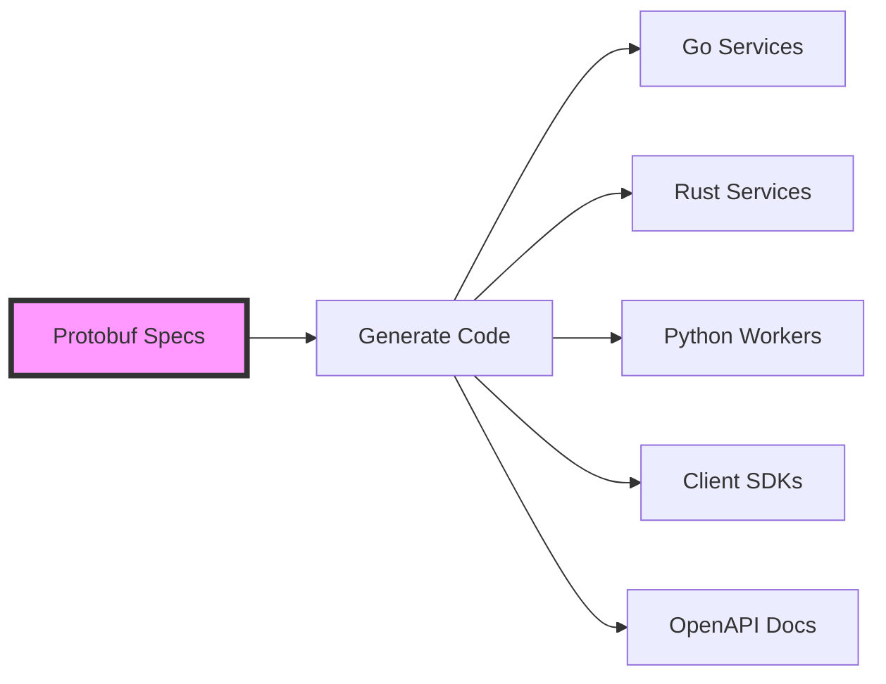
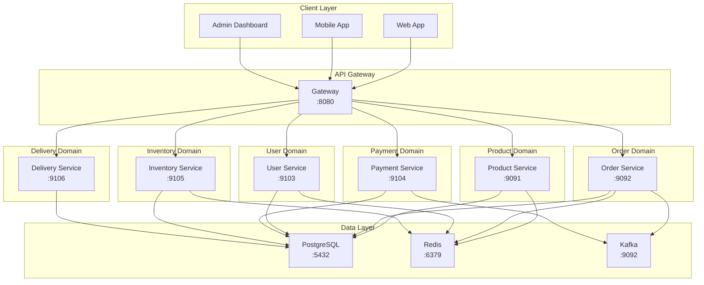

# Introduction

## What is Shinkansen Commerce?

Shinkansen Commerce is a production-grade e-commerce platform demonstrating modern backend engineering practices. Built as a portfolio project for senior backend engineer positions, it showcases:

- **Spec-first development**: Protocol Buffers define API contracts
- **Polyglot architecture**: Go, Rust, Python services
- **Microservices**: 7 independent, deployable services
- **Japan market focus**: Konbini payments, point systems

## Philosophy

> **The Specification (.proto) is the source of truth. Code is just a byproduct.**

This project follows a contract-first approach where API definitions in protobuf files drive everything:

## Architecture Overview

## Technology Stack

| Component | Technology | Purpose |
|-----------|-----------|---------|
| **Core Services** | Go 1.21 | gRPC servers, business logic |
| **Performance Services** | Rust | High-throughput inventory |
| **Analytics** | Python 3.11 | Data processing, ML |
| **API Gateway** | Go (http) | REST API, middleware |
| **Communication** | gRPC, Protocol Buffers | Inter-service communication |
| **Database** | PostgreSQL 15 | Persistent storage |
| **Cache** | Redis 7 | Caching, sessions |
| **Message Queue** | Kafka 3.5 | Event-driven architecture |
| **Orchestration** | Kubernetes | Container orchestration |
| **CI/CD** | GitHub Actions | Automated builds, tests |

## Services

| Service | Port | Language | Responsibilities |
|---------|------|-----------|------------------|
| Product Service | 9091 | Go | Product catalog, search, variants |
| Order Service | 9092 | Go | Order lifecycle, status management |
| User Service | 9103 | Go | Authentication, profiles, addresses |
| Payment Service | 9104 | Go | Payment processing, Konbini, points |
| Inventory Service | 9105 | Rust | Stock management, reservations |
| Delivery Service | 9106 | Go | Delivery slots, shipments |
| Analytics Worker | - | Python | Reporting, insights |

## Japan-Specific Features

### Konbini Payments
- 7-Eleven (セブン-イレブン)
- Lawson (ローソン)
- FamilyMart (ファミリーマート)
- Ministop (ミニストップ)
- Seicomart (セイコーマート)

Payment slip generation, 30-minute payment window, webhook processing.

### Point System
Multi-vendor point ecosystem:
- Earn points on purchases
- Redeem at checkout
- Cross-vendor sharing
- Expiration management

### Same-Day Delivery
- PostGIS for geospatial queries
- Delivery slot management
- Real-time inventory checks
- Tracking integration

## Documentation

- [Quick Start Guide](/quickstart) - Get running in 5 minutes
- [Architecture](/architecture/overview) - System design
- [API Reference](/api/overview) - Complete API documentation
- [Development](/development/setup) - Local development setup
- [Runbooks](/runbooks/deployment) - Operational procedures

## Key Features

### Spec-First Development
- Protocol Buffers as single source of truth
- Auto-generated Go, Rust, Python code
- Type-safe communication
- API documentation generated from specs

### Microservices Architecture
- 7 independent services
- gRPC inter-service communication
- Independent deployment
- Horizontal scaling

### High Performance
- Redis caching for hot data
- Connection pooling
- Optimistic locking for concurrency
- Handles 10K+ concurrent requests

### Production-Ready
- JWT authentication
- Rate limiting
- Circuit breakers
- Observability (Prometheus, Grafana, Jaeger)

## Getting Started

See the [Quick Start Guide](/quickstart) to get the platform running in 5 minutes.

## Contributing

This project demonstrates:
- System architecture skills
- Polyglot programming
- DevOps & infrastructure as code
- Japanese e-commerce domain knowledge
- Production-grade practices

## License

MIT License - see [LICENSE](https://github.com/afasari/shinkansen-commerce/blob/main/LICENSE) for details.
