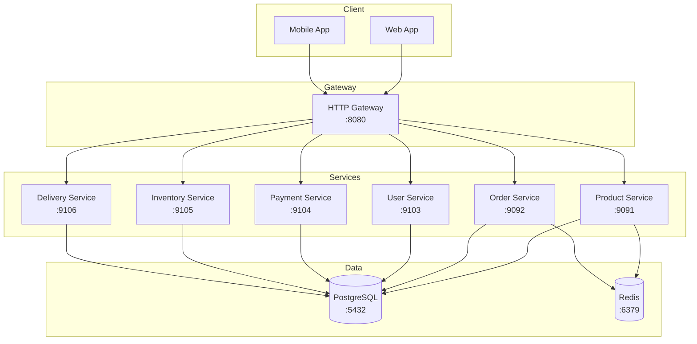

# Quick Start Guide

This guide will help you get the Shinkansen Commerce platform up and running in 5 minutes.

## Prerequisites

- [Docker](https://www.docker.com/products/docker-desktop) and Docker Compose
- [Go 1.21+](https://golang.org/dl/) (for local development)
- [Make](https://www.gnu.org/software/make/)
- [uv](https://astral.sh/uv/) (Python package manager) - optional, for analytics worker

## Quick Start (5 minutes)

### 1. Start All Services

```bash
# Start PostgreSQL, Redis, and all 7 microservices
make up

# Wait for services to be healthy (30-60 seconds)
docker-compose ps
```

### 2. Test the Platform

```bash
# Run integration tests (tests complete order flow)
make test-integration

# Or test individual endpoints
curl http://localhost:8080/health

# Register a user
curl -X POST http://localhost:8080/v1/users/register \
  -H "Content-Type: application/json" \
  -d '{
    "email": "user@example.com",
    "password": "password123",
    "name": "John Doe",
    "phone": "090-1234-5678"
  }'

# List products
curl http://localhost:8080/v1/products
```

### 3. View Logs

```bash
# View all logs
make logs

# View specific service logs
docker-compose logs gateway
docker-compose logs product-service
```

### 4. Stop Services

```bash
# Stop all services
make down

# Stop and remove volumes (full cleanup)
make clean-all
```

## Services

| Service | Port | Description |
|---------|------|-------------|
| Gateway (HTTP) | 8080 | REST API gateway |
| Product Service | 9091 | Product catalog (gRPC) |
| Order Service | 9092 | Order management (gRPC) |
| User Service | 9103 | User authentication (gRPC) |
| Payment Service | 9104 | Payment processing (gRPC) |
| Inventory Service | 9105 | Stock management (gRPC) |
| Delivery Service | 9106 | Shipping & delivery (gRPC) |
| PostgreSQL | 5432 | Database |
| Redis | 6379 | Cache |

## Development Workflow

### Build All Services

```bash
# Build all Go services to bin/
make build-all

# Or build specific service
make build-gateway
make build-product-service
make build-order-service
make build-user-service
make build-payment-service
make build-inventory-service
make build-delivery-service
```

### Run Tests

```bash
# Run unit tests for all services
make test

# Run tests with coverage
make test-coverage

# Run integration tests
make test-integration
```

### Generate Code

```bash
# Generate gRPC code from protobufs
make proto-gen

# Generate SQL code
make sqlc-gen

# Generate OpenAPI docs
make proto-openapi-gen

# Generate all code
make gen
```

## API Endpoints

### User Management
- `POST /v1/users/register` - Register new user
- `POST /v1/users/login` - Login
- `GET /v1/users/me` - Get current user
- `PUT /v1/users/me` - Update profile
- `GET /v1/users/me/addresses` - List addresses
- `POST /v1/users/me/addresses` - Add address

### Products
- `GET /v1/products` - List products
- `GET /v1/products/{id}` - Get product
- `GET /v1/products/search` - Search products
- `GET /v1/products/variants` - Get product variants

### Orders
- `GET /v1/orders` - List orders
- `POST /v1/orders` - Create order
- `GET /v1/orders/{id}` - Get order
- `POST /v1/orders/{id}/status` - Update status
- `POST /v1/orders/{id}/cancel` - Cancel order

### Payments
- `POST /v1/payments` - Create payment
- `GET /v1/payments/{id}` - Get payment
- `POST /v1/payments/{id}/process` - Process payment
- `POST /v1/payments/{id}/refund` - Refund payment

### Inventory
- `GET /v1/inventory/stock` - Get stock level
- `PUT /v1/inventory/stock` - Update stock
- `POST /v1/inventory/reserve` - Reserve stock
- `POST /v1/inventory/release` - Release reservation

### Delivery
- `GET /v1/delivery/slots` - Get delivery slots
- `POST /v1/delivery/slots` - Reserve slot
- `GET /v1/shipments/{id}` - Get shipment
- `PUT /v1/shipments/{id}/status` - Update status

## Architecture



## Database Schema

The database contains 6 schemas:
- `catalog` - Products, categories, variants
- `orders` - Orders, order items
- `users` - Users, addresses
- `payments` - Payments, transactions
- `inventory` - Stock items, movements, reservations
- `delivery` - Delivery zones, slots, shipments

## Troubleshooting

### Services Not Starting

```bash
# Check service logs
docker-compose logs [service-name]

# Restart specific service
docker-compose restart [service-name]

# Rebuild and start
make clean
make build-all
make up
```

### Database Issues

```bash
# Reset database
make down
docker volume rm shinkansen-commerce_postgres_data
make up
```

### Port Already in Use

```bash
# Check what's using the port
lsof -i :8080

# Change port in docker-compose.yml
# Or kill the process
```

## Environment Variables

Services can be configured with environment variables:

| Variable | Default | Description |
|----------|---------|-------------|
| `HTTP_SERVER_ADDRESS` | `:8080` | Gateway HTTP port |
| `JWT_SECRET` | `your-jwt-secret-change...` | JWT signing key |
| `DATABASE_URL` | `postgres://...` | PostgreSQL connection |
| `REDIS_URL` | `redis://localhost:6379` | Redis connection |

## Next Steps

- [Architecture Overview](/architecture/overview)
- [API Documentation](/api/overview)
- [Development Guide](/development/setup)
- [Runbooks](/runbooks/deployment)
